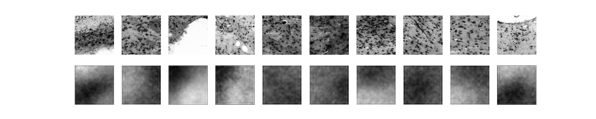

## Getting started

### Poetry

if poetry not installed download it

- [install guide](https://python-poetry.org/docs/#installation)
- `poetry install` to install al packages
- `poetry shell` start virtual environment
- `poetry add [package]` add new package
