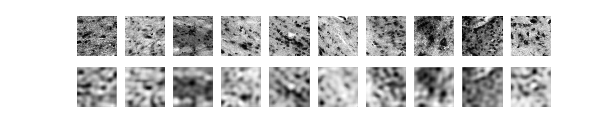

)

# Variational Autoencoder for Microscopic Image Analysis

Welcome to the **Variational Autoencoder Project Repository** for the course **Deep Learning: Generative Models**, led by **Prof. T. Dickscheid**. This repository contains our work on developing a Variational Autoencoder (VAE) to analyze and model microscopic images of the **olfactory tubercle** in the basal forebrain.

## About This Project

This project is centered around using deep learning to explore the structural differences in **terminal islands**—clusters of small neurons in the olfactory tubercle, characterized by granocellular and parvocellular morphologies. Understanding these structures is vital for investigating their potential links to brain disorders like schizophrenia.

The primary goals include:

1. Automatically identifying and distinguishing terminal island structures.
2. Training a VAE to learn compact latent representations of these structures.
3. Using these representations to analyze and visualize the latent space, generate synthetic samples, and explore structural transitions.

All deep learning implementations leverage **PyTorch** for efficient model training and data handling.

---

# Getting started

## Poetry

if poetry not installed download it

- [install guide](https://python-poetry.org/docs/#installation)
- `poetry install` to install al packages
- `poetry shell` start virtual environment
- `poetry add [package]` add new package

## Results

Reconstruction:

Sampling

